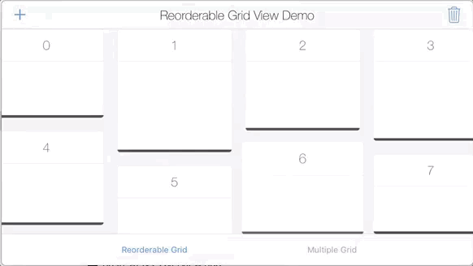

# ReorderableGridView


Reorderable grid view solution implemented with swift. <br>

Its UIScrollView subclass, its not a collection view layout.<br>
automatically sets horizontal item spacing by item widths. so items must be fixed-width.<br>
also sets automatically its content size. <br>

if you call `gridView?.invalidateLayout()` after orientation changed, it will lays out the grid by new orientation.

```swift
override func viewWillTransition(to size: CGSize, with coordinator: UIViewControllerTransitionCoordinator) {
gridView?.setW(w: size.width, h: size.height)
gridView?.invalidateLayout()
}
```

# Demo



Happy coding :+1:  :sparkles:
